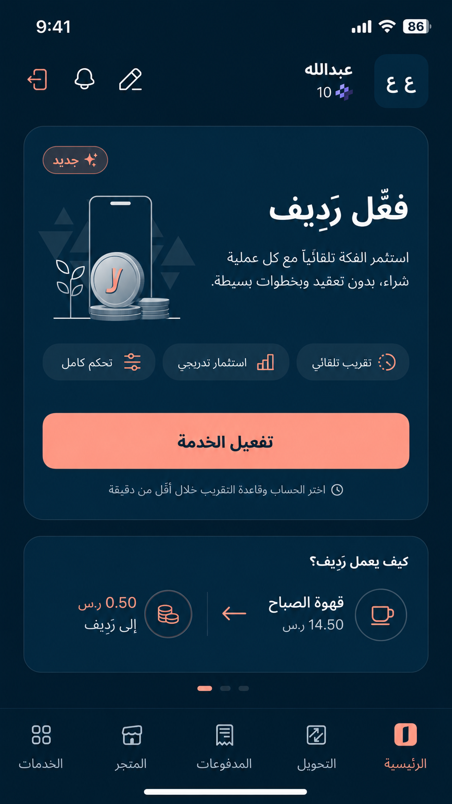
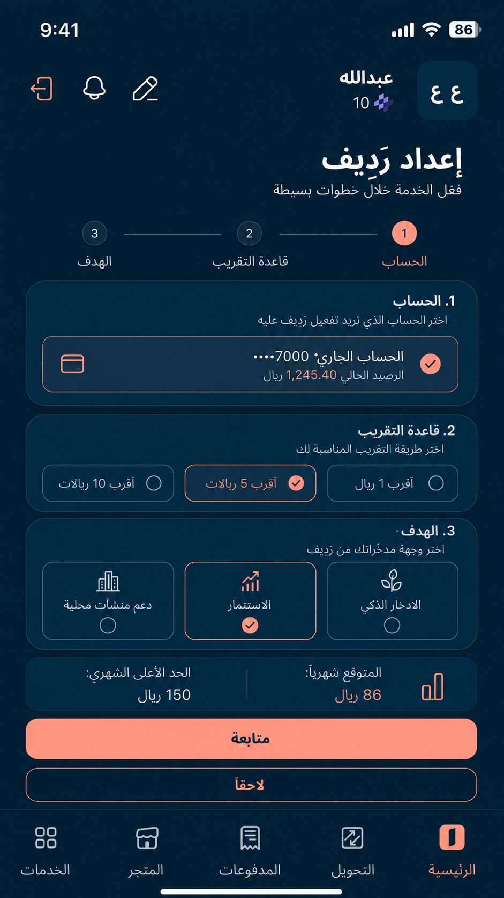
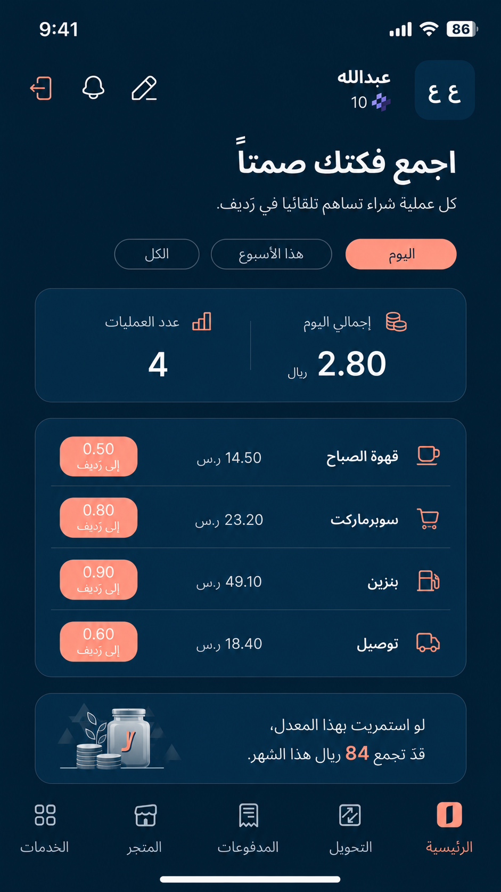
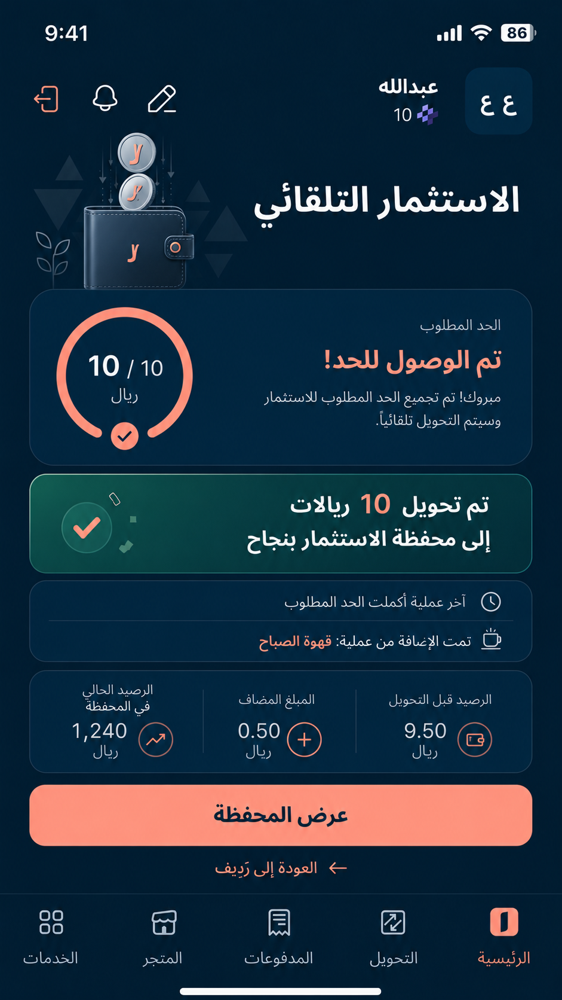
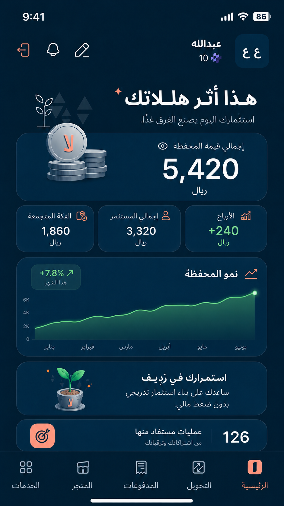
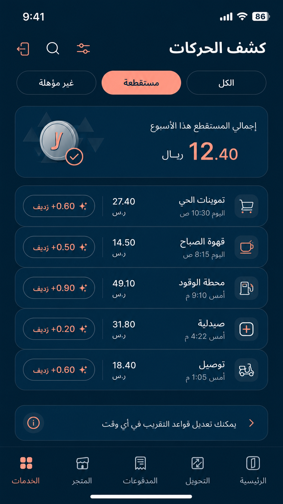
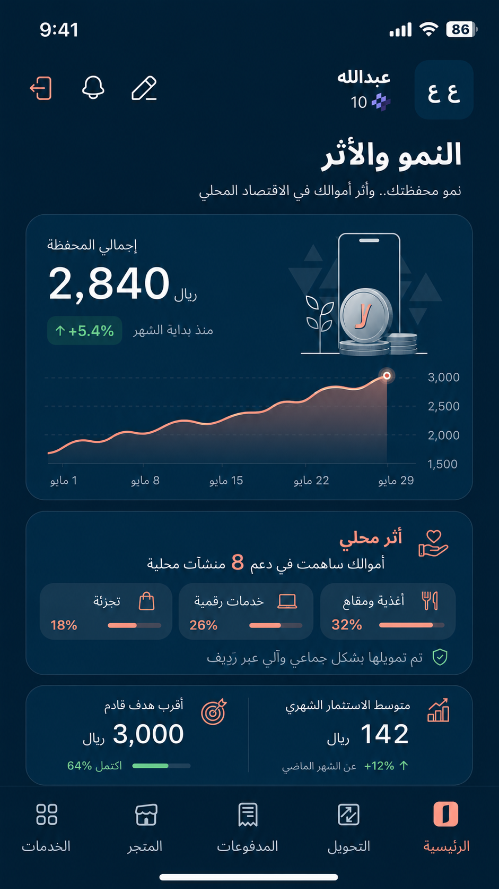
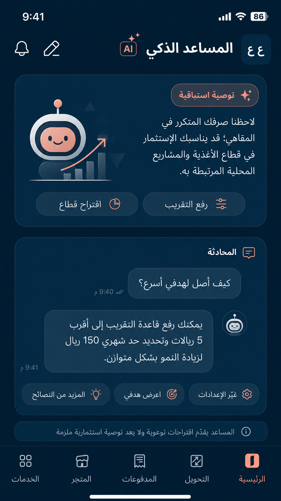

رديف — Radeef

نظام بيئي مالي متكامل (Financial Ecosystem) — سوق تمويل تشاركي مؤتمت داخل بنك الإنماء، يحوِّل الهللات المهدرة إلى صكوك استثمارية تغذي المنشآت الصغيرة والمتوسطة.

  

---

المشكلة | The Problem

من جهة| المشكلة
الفرد| يريد ادخارًا واستثمارًا لكنه يعاني قلة رأس المال، ضعف المعرفة، والخوف من المخاطرة
التاجر (SME)| يحتاج تمويلًا بضمانات أقل وفوائد منخفضة بعيدًا عن التعقيدات البنكية التقليدية
البنك| يريد دعم المنشآت الصغيرة ورؤية 2030 دون تحميل ميزانيته مخاطر إضافية

الحل | The Solution

1. للعميل (المستثمر الفرد)

- الاستقطاع المزدوج: تقريب الهللات من المشتريات اليومية + استثمار مباشر
- المساعد الذكي (AI Advisor): يحلل مدفوعاتك ويقترح مبلغ الادخار الأمثل
- تحديد المخاطرة: اختر مستوى المخاطرة (منخفضة — متوسطة — عالية)
- العوائد: أرباح مجزية توزع نهاية المدة

2. للتاجر (SME)

- تمويل مرن: استلام المبلغ على دفعات مع اكتمال التجميع من المستثمرين
- تكلفة أقل: أرباح/فوائد أقل من القروض التقليدية
- سمعة مجتمعية: التمويل يأتي من أفراد المجتمع

3. لبنك الإنماء

- تمويل بدون مخاطرة على رأس المال — التمويل من الأفراد لا ميزانية البنك
- رسوم إدارية — أرباح من التاجر ومن المستثمر
- ولاء العميل — التطبيق مصدر دخل وتنمية للعملاء
- دعم رؤية 2030 — تمكين المنشآت الصغيرة والمتوسطة

---

معرض الصور | Screenshots

  
  

  
  

  
  

  
  

---

  <a href="https://radeef.lat" target="_blank"><strong>جرّب رديف مباشرة</strong></a>

رديف — رديفك في الادخار والاستثمار.